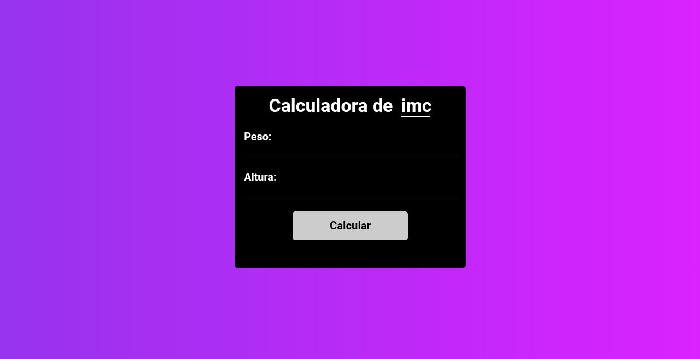

<h1 align="center">Calculadora de IMC</h1>

Projeto de calculadora de IMC com layout simples

<h3>Linguagens utilizadas</h3>
<ul style="list-style:none;">
    <li>HTML</li>
    <li>CSS</li>
    <li>JS</li>
</ul>
